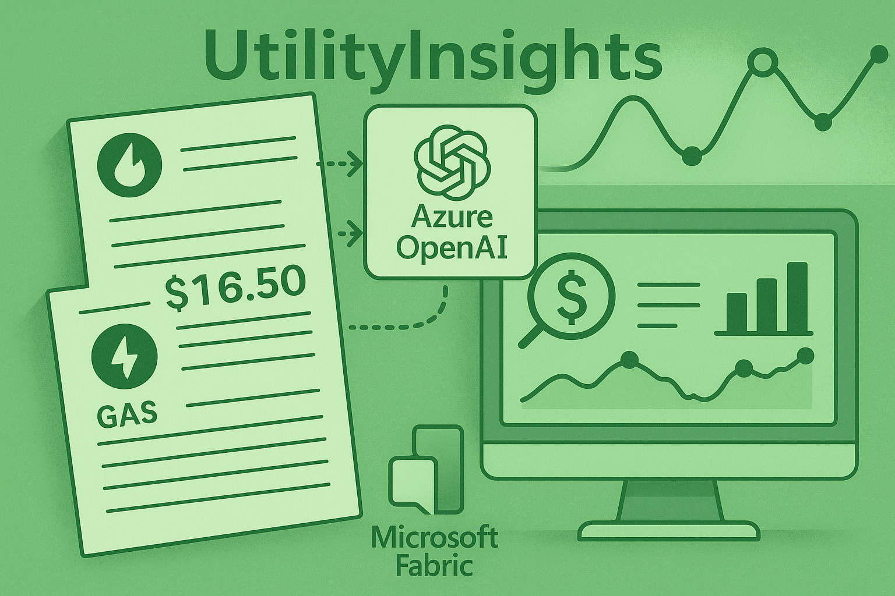

# UtilityInsights
This project uses Azure OpenAI and Microsoft Fabric to analyze billing statements and extract electricity and gas expenses to generate insights.

# How to Run

### Full Deployment
The following commands should be executed from the Azure Cloud Shell at https://shell.azure.com using bash. The first step is to login into the console. Make sure yo uselect a Subscription if asked.
```bash
az login
```
After that, just run the following commands:
```bash
git clone https://github.com/WeaveAnalytics/UtilityInsights.git
cd UtilityInsights
bash azure_deploy.sh
```
This completes the deployment of all Azure services. Now, from the Fabric Admin portal, make sure the entire organization has Contributor permissions on the newly create Fabric Capacity (printed by previous step). This assignment can be removed once the deployment is completed.

Finally, run the following script to complete the Fabric deployment:
```bash
bash fabric_deploy.sh
```


### Simplified Deployment:
If you already have all services needed, you can skip the automated deployment, and:
1. Upload the [documentextract.ipynb]([https://github.com/microsoft/needlr/tree/main/samples](https://github.com/WeaveAnalytics/UtilityInsights/blob/main/documentextract.ipynb)) notebook
2. Set a default Lakehouse for the Notebook
3. Update the Azure OpenAI URL and Key on the first cell of the notebook/
4. Upload some sample bills and run the notebook

# What's Deployed
- Azure OpenAI service
- Azure KeyVault to store secrets
- Azure Fabric Capacity to use in the process
- A new Entra ID App Registration that cfreates the right Fabric items
- A new Fabric Workspace with the items (Lakehouse and Noteook) required to test UtilityInsights
